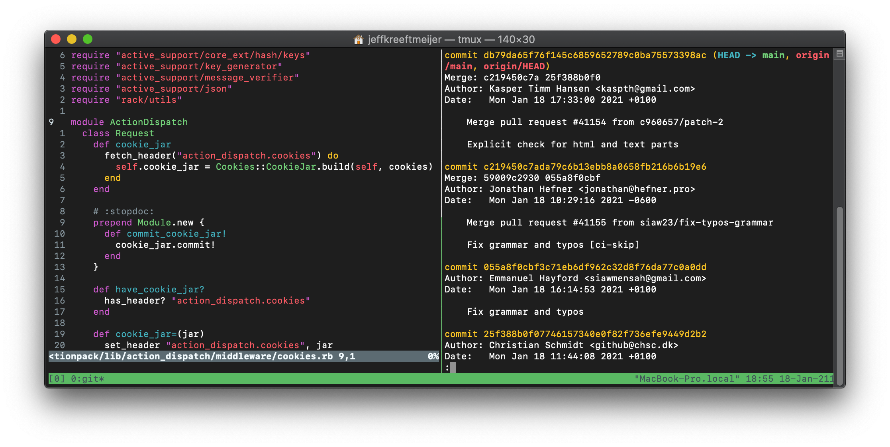
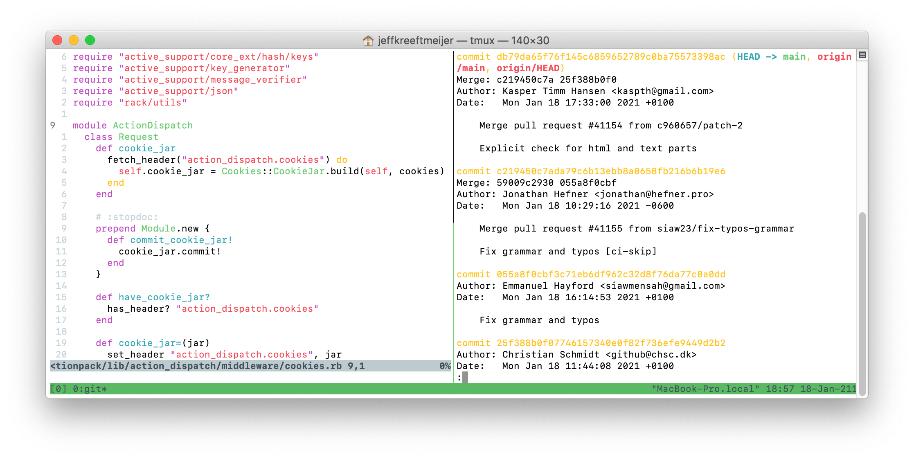

# darklight.terminal

An ANSI color profile for Terminal.app, based on
[appsignal.terminal](https://github.com/jeffkreeftmeijer/appsignal.terminal),
but without background colors for automatic switching between macOS's dark and
light appearances. Great with Vim's default colorscheme, even better with
[Dim](https://github.com/jeffkreeftmeijer/vim-dim).

## Installation

    $ curl -00 https://raw.githubusercontent.com/jeffkreeftmeijer/darklight.terminal/main/darklight.terminal
    $ open darklight.terminal
